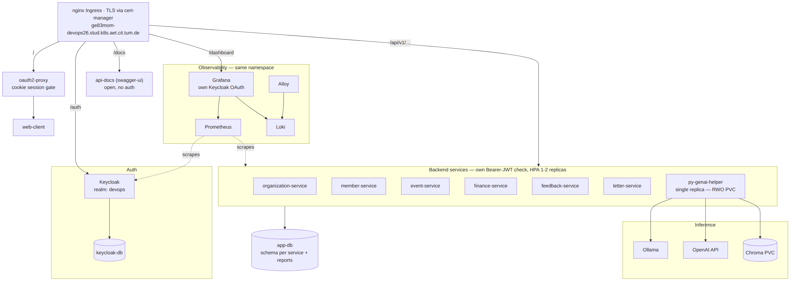
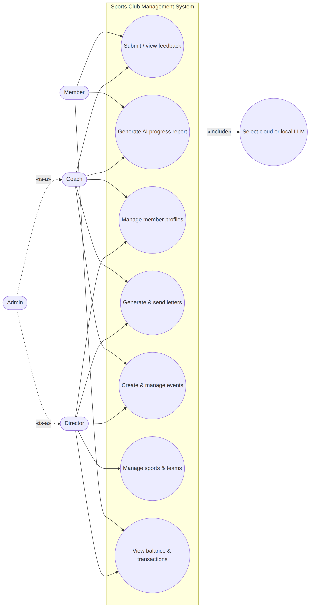
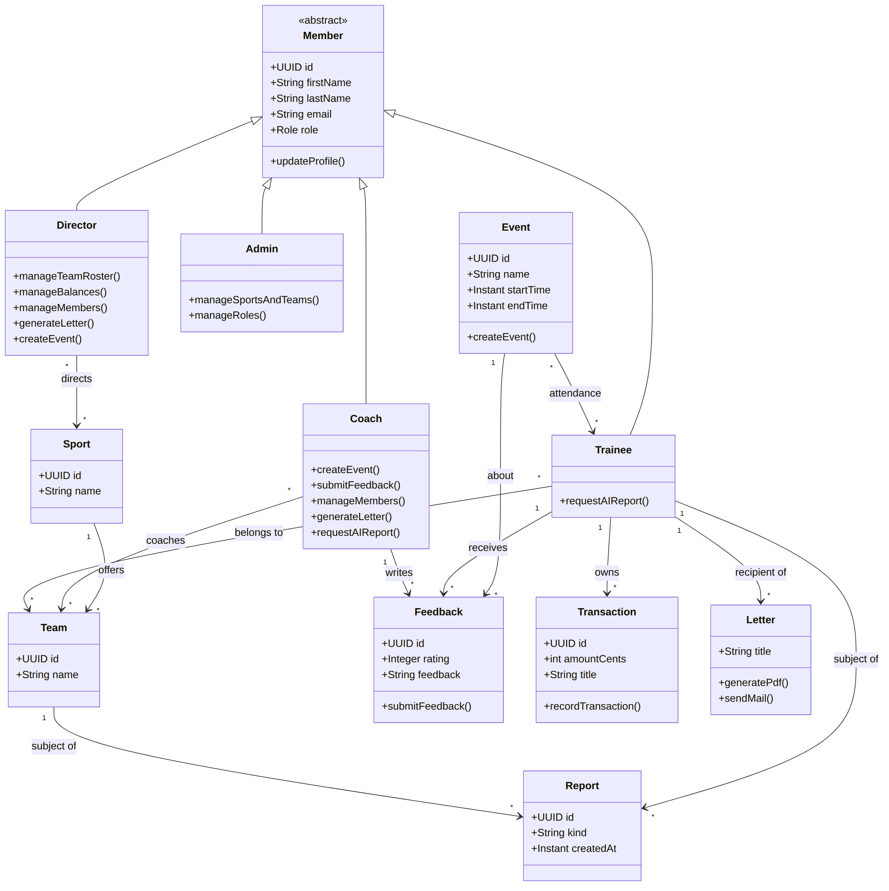

# Architecture

This is the detailed companion to the [README's Architecture section](../README.md#architecture): per-service responsibilities, who calls whom, and how a request is authenticated end to end. The diagrams below reflect the current six-service system; the PNGs under [`docs/outdated/`](outdated/) model an earlier three-service topology and are kept only as historical record. Diagram sources live in [`docs/diagrams/`](diagrams/) as Mermaid files — see [`docs/diagrams/README.md`](diagrams/README.md) to regenerate them after an architecture change.

## Subsystem Decomposition

Depicts the Kubernetes (Rancher/RKE2) deployment specifically, since it's the one continuously-live, gradeable cluster target — see [Environment differences](#environment-differences) below for how Compose/VM differ. `oauth2-proxy` only gates the web-client's cookie session; every backend service, Keycloak, api-docs, and Grafana are reached directly through the ingress and each does its own auth (Bearer-JWT check, or in Grafana's case its own separate Keycloak OAuth client) — there is no single shared gatekeeper. Note also the two independent PostgreSQL instances: `app-db` (schema-per-service, described below) and a separate `keycloak-db` that only Keycloak uses.

## Subsystems

### Client — `web-client`

A React 19 + TypeScript SPA (Vite). It is the only subsystem with a UI, and it talks to **every** backend service directly over REST through the reverse proxy — there is no backend-for-frontend or API gateway aggregation layer. Each feature area (members, events, feedback, finance, letters, organization, the GenAI helper) has its own typed API client generated from `api/openapi.yaml`.

Auth: `keycloak-js` (PKCE S256) obtains a JWT from Keycloak; an Axios request interceptor attaches it as `Authorization: Bearer <token>` and refreshes it proactively when it's within 30s of expiry.

### Server — six Spring Boot 3 microservices

| Service | Owns | Notes |
|---|---|---|
| Organization | sports, teams, role assignment | Also calls the Keycloak Admin REST API directly (`KeycloakRoleService`) to keep realm role assignments in sync with team/role changes made in-app |
| Member | member profiles | Also calls the Keycloak Admin REST API (`KeycloakService`) for the same reason |
| Event | training sessions, enrollment, attendance | |
| Feedback | trainer feedback, progress notes | Read by the GenAI service (see below) |
| Finance | one-time/recurring billing | |
| Letter | PDF/email generation from templates | The only Spring service with no database — templates and generated artifacts are not persisted as domain rows |

Each service is a stateless OAuth2 resource server: it validates the incoming Bearer JWT against Keycloak's JWK set and maps `realm_access.roles` claims to Spring `ROLE_*` authorities. None of the six call each other directly — the only cross-service traffic on the server side is organization/member → Keycloak (role sync) and GenAI → feedback (below).

Organization-service and member-service both authenticate to the Keycloak Admin REST API as the same confidential client, `org-role-sync` (service-account/client-credentials grant — see [Proxy & Auth](#proxy--auth-traefik--nginx-ingress--keycloak) below). Neither hardcodes its secret; both read it from an env var (`KEYCLOAK_ADMIN_CLIENT_SECRET` / `KEYCLOAK_SERVICE_ACCOUNT_CLIENT_SECRET` respectively) sourced from the same GitHub secret in every deploy target — see [docs/cicd.md](cicd.md).

### GenAI — `py-genai-helper`

A Python 3.12 / Flask service using LangChain. Unlike the Spring services, it is a REST **client** as well as a server:

- It calls **feedback-service** (`GET /feedback`, Bearer-forwarded) to pull the data it summarizes when generating a member/team report.
- It calls **either OpenAI or a local Ollama instance** to run inference, selected per-request via the `uselocal` field on the report-generation endpoints (not a global config flag) — the web client exposes this as the "Use local LLM" toggle on the helper page.
- RAG question-answering persists uploaded documents in a **Chroma** vector store (a PVC-backed directory in Kubernetes, a bind-mounted volume elsewhere), not PostgreSQL.
- Generated report text *is* persisted in PostgreSQL, though: the service owns a sixth schema, `reports` (`reports_user`), in the same instance as the Spring services, with its tables created idempotently at startup since Python has no Flyway.

### Database — PostgreSQL

Single instance, schema-per-service, documented in the [README's Database section](../README.md#database) — five schemas for the five Spring services that own one, plus the `reports` schema owned by the GenAI service (see above). Every service user is also granted a shared, read-only `reader` role (`infra/postgres/init-db.sh`) that can `SELECT` across all schemas but never write outside its own; this backs a handful of small, explicitly-documented read-only lookups — e.g. `event-service`'s `MemberEntity`, `letter-service`'s `TransactionEntity`, and the GenAI service's own member/team display-name lookups — used only to resolve a name or balance for display, never to write, and never as a substitute for calling the owning service's API. Cross-schema foreign keys (e.g. `event.events.creator_id → member.members.id`) are enforced by the database independently of this.

### Proxy & Auth — Traefik / nginx ingress + Keycloak

- **Docker Compose / Azure VM**: Traefik terminates TLS (Let's Encrypt on the VM), applies a `forward-auth` middleware backed by its own confidential Keycloak client (session-cookie based, separate from the app-level Bearer tokens below), and strips path prefixes before forwarding to each service.
- **Kubernetes**: the cluster's own nginx ingress does the prefix-stripping and routing instead of Traefik; TLS is handled at the cluster edge.
- **Keycloak** (realm `devops`) is the single OIDC provider in every environment. Four confidential/public clients exist: `devops-client` (public, PKCE — the React app), `traefik-forward-auth` (confidential — gates the browser session at the proxy), `grafana` (confidential — Grafana's own admin-only OAuth login), and `org-role-sync` (confidential, service account only, no browser flow — organization-service and member-service's Admin REST API client, see above). None of the three confidential clients' secrets is hardcoded: each is templated as a `__PLACEHOLDER__` in `infra/keycloak/realm-config.json`, substituted at container start (Compose/VM) or chart render (Helm) from the matching GitHub secret — see [docs/cicd.md](cicd.md).

## Use Cases

Route access is role-gated client-side (`web-client/src/app/navPolicy.ts`) and re-checked server-side by each service. Four roles exist: `member` (trainee), `trainer` (coach), `director`, `admin`. All four can additionally view the dashboard, browse events & sessions, view sports & teams, and manage their own profile — those baseline pages are omitted from the diagram below since every role shares them; only the role-differentiating capabilities are shown. Admin's capabilities are exactly the union of Coach's and Director's, with nothing unique of its own, so it's shown as generalizing both (`«is-a»`) rather than duplicating every edge.

## Analysis Object Model

Modeled from the client's perspective — its `Role` type (`web-client/src/types.ts`) and each feature's role-gated actions — rather than the server's join-table implementation (`DirectorEntity`/`TrainerEntity`/`TraineeEntity`, each scoped to one sport or team). A person's role is a single flat attribute from the client's standpoint, not a per-scope assignment, so `Trainee`/`Coach`/`Director`/`Admin` are modeled as specializations of `Member` to group each role's distinct capabilities clearly. The two relationships that genuinely are per-scope — a coach coaches specific teams, a director directs specific sports — are kept as separate associations rather than folded into the role itself. Feedback, balances, letters, event attendance, and generated reports are all about a `Trainee` specifically (coaches and directors act on them, but are never themselves the subject), so those associations sit on `Trainee` rather than the abstract `Member` — matching the client's own `ReportKind`-discriminated `Report` type, member and team reports are modeled as one `Report` class rather than two near-identical ones.

## Request lifecycle (example: loading the members page)

1. Browser requests `/` → proxy's forward-auth middleware checks for a session cookie; none yet → redirected through Keycloak's login page → cookie set on success.
2. `web-client` (now loaded) separately obtains its own JWT via `keycloak-js`, independent of the forward-auth session cookie above — these are two different auth mechanisms layered on the same Keycloak realm, not one shared session.
3. `web-client` calls `GET /api/v1/members` with `Authorization: Bearer <jwt>`.
4. Proxy strips `/api/v1` (member-service's own routes start at `/members`), forwards to `member-service`.
5. `member-service` validates the JWT against Keycloak's JWK set, maps roles, authorizes, queries its own `member` schema, returns JSON.

The GenAI report-generation flow adds one more hop: `web-client → py-genai-helper → feedback-service` (step 3 becomes two REST calls instead of one, with the same Bearer token forwarded along), plus an out-of-band call from `py-genai-helper` to OpenAI or Ollama that never passes through the proxy.

## Environment differences

The only things that differ between local Docker Compose, the Azure VM, and Kubernetes are: the proxy implementation (Traefik vs. nginx ingress), the JWT issuer URI each service is configured with (must match the `iss` claim of tokens actually issued by that environment's Keycloak — internal Docker hostname locally, public HTTPS URL on the VM, internal ClusterIP DNS on Kubernetes), and TLS termination. The application code and the Prometheus scrape config are identical across all three — see [docs/deployment.md](deployment.md).
