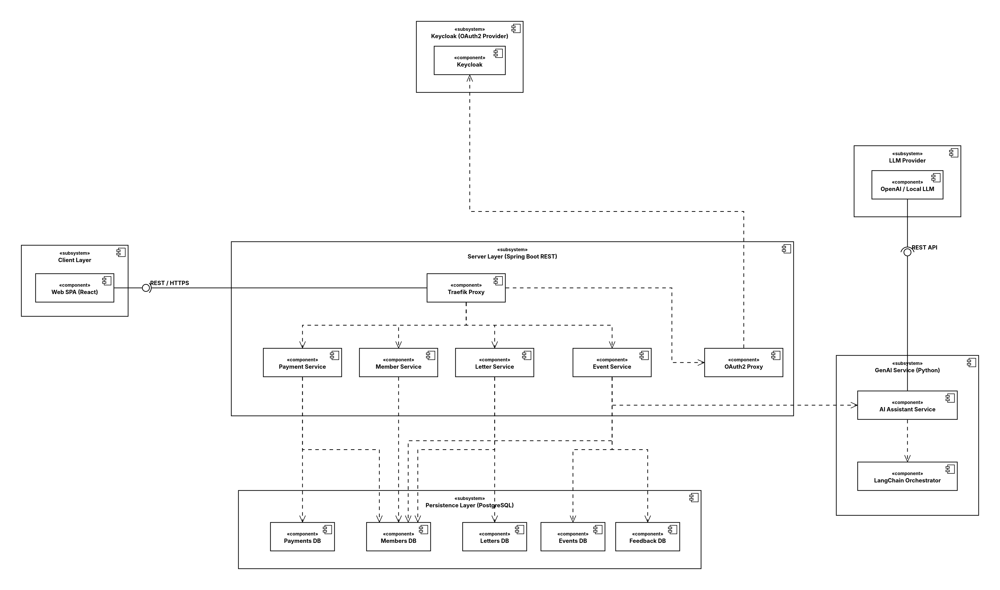
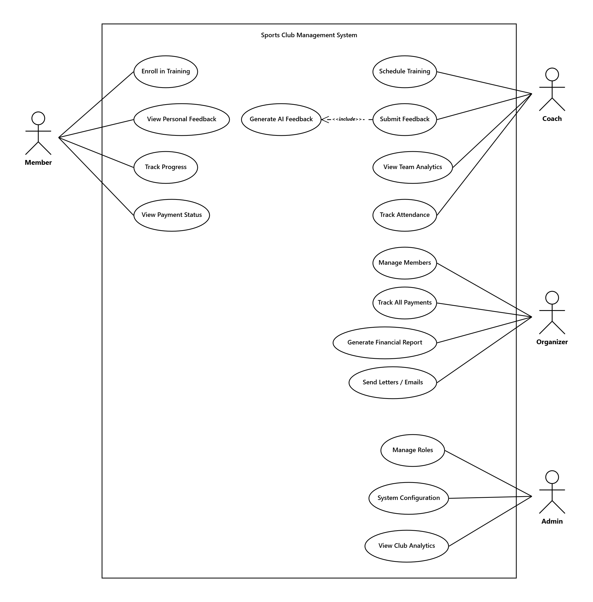
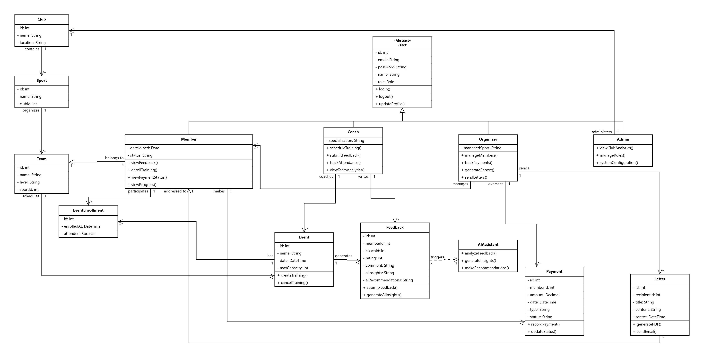

## 1. Initial System Structure

### Server: Spring Boot REST API (Java + Gradle)

- **Member Service** (Port 8001): User management, profiles, roles
- **Event Service** (Port 8002): Training scheduling, enrollment, attendance tracking
- **Payment Service** (Port 8003): Payment recording, status tracking, billing

### Client: React Frontend

- Single Page Application (Port 3000)
- Responsive UI for all user roles (Member, Coach, Organizer, Admin)
- Consumes REST APIs from backend services

### GenAI Service: Python, LangChain Microservice

- Flask-based service (Port 5000)
- Analyzes member data and training feedback
- Generates personalized feedback and recommendations
- Supports both cloud (OpenAI) and local LLM models
- Called by backend services, not directly by frontend

### Database: PostgreSQL

- Single shared instance (Port 5432)
- Persistent storage for all services
- Tables: Users, Teams, Events, Payments, Feedback, GenAI Conversations

### Proxy: Traefik

- All services are hidden behind a Traefik proxy
- Responsible for authentication
- Takes care of load balancing

---

## 2. UML Diagrams

### 2.1 Component Diagram (Top-Level Architecture)

---

### 2.2 Use Case Diagram

---

### 2.3 Analysis Object Model (Class Diagram)

---
